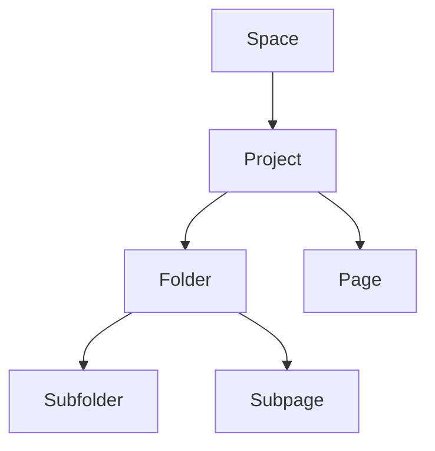

## Overview

Bertus Erlank provides a structured way to manage your project documentation. You organize content into spaces, hierarchies, versions, and permissions. These concepts form the foundation for efficient collaboration and maintenance.

<Callout kind="info">
  Master these concepts to streamline your documentation workflow.
</Callout>

## Documentation Spaces

Documentation spaces act as containers for related projects. Create a space for each major initiative, such as product docs or API references.

<Columns cols={2}>
  <Card title="Public Spaces" icon="globe" href="#">
    Accessible to everyone. Ideal for open-source projects.
  </Card>
  <Card title="Private Spaces" icon="lock" href="#">
    Restricted access. Use for internal company knowledge bases.
  </Card>
</Columns>

Use the API to create a space:

<CodeGroup tabs="JavaScript,Python">
  ```javascript
  const response = await fetch('https://api.example.com/v1/spaces', {
    method: 'POST',
    headers: { 'Authorization': `Bearer ${YOUR_API_KEY}` },
    body: JSON.stringify({
      name: 'My Project Docs',
      visibility: 'private'
    })
  });
  ```
  ```python
  import requests
  response = requests.post(
    'https://api.example.com/v1/spaces',
    headers={'Authorization': f'Bearer {YOUR_API_KEY}'},
    json={'name': 'My Project Docs', 'visibility': 'private'}
  )
  ```
</CodeGroup>

## Project Organization Hierarchy

Organize content within spaces using a clear hierarchy: spaces contain projects, projects contain pages and folders.



This structure mirrors file systems, making navigation intuitive.

## Version Control Basics

Bertus Erlank integrates version control similar to Git. You branch, commit, and merge changes without external tools.

<Steps>
  <Step title="Create Branch" icon="git-branch">
    Branch from main for new features.
  </Step>
  <Step title="Commit Changes" icon="git-commit">
    Save edits with descriptive messages.
  </Step>
  <Step title="Merge & Publish" icon="git-merge">
    Review and merge to production.
  </Step>
</Steps>

Example commit via API:

```bash
curl -X POST https://api.example.com/v1/pages/commit \
  -H "Authorization: Bearer YOUR_API_KEY" \
  -d '{
    "pageId": "page-123",
    "message": "Add authentication section",
    "content": "# New Section\nUpdated docs."
  }'
```

<Callout kind="tip">
  Always use semantic commit messages like `feat: add login guide` or `fix: correct API endpoint`.
</Callout>

## User Permissions Overview

Control access with role-based permissions. Assign roles at space, project, or page levels.

<Tabs>
  <Tab title="Admin" icon="shield">
    Full control: edit, delete, manage users.
  </Tab>
  <Tab title="Editor" icon="edit-3">
    Read/write pages, no user management.
  </Tab>
  <Tab title="Viewer" icon="eye">
    Read-only access.
  </Tab>
</Tabs>

<ExpandableGroup>
  <Expandable title="Custom Permissions" default-open="true">
    Fine-tune with granular settings:

    | Action       | Admin | Editor | Viewer |
    |--------------|-------|--------|--------|
    | Edit Pages   | ✅    | ✅     | ❌    |
    | Delete       | ✅    | ❌     | ❌    |
    | Manage Users | ✅    | ❌     | ❌    |
  </Expandable>
  <Expandable title="API Permissions">
    Use scopes in tokens:

    <ParamField header="X-Scope" param-type="string" required="true">
      Comma-separated: `spaces:read,projects:write`.
    </ParamField>
  </Expandable>
</ExpandableGroup>

These concepts enable scalable documentation. Start by creating your first space to apply them hands-on.