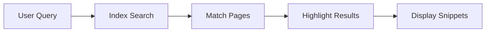

## Overview

Bertus Erlank provides a comprehensive suite of tools to help you organize, collaborate on, and customize your project documentation. You can structure complex document hierarchies, share content securely with teams, leverage powerful search, and tailor the interface to your needs. These features enable efficient knowledge management for any project size.

<Columns cols={2}>
  <Card title="Document Structuring" icon="file-text" href="#document-structuring">
    Build nested pages and menus effortlessly.
  </Card>
  <Card title="Collaboration" icon="users" href="#collaboration">
    Invite team members and manage permissions.
  </Card>
  <Card title="Search" icon="search" href="#search">
    Find content instantly across your docs.
  </Card>
  <Card title="Customization" icon="settings" href="#customization">
    Personalize themes and layouts.
  </Card>
</Columns>

## Document Structuring Tools

Create organized documentation spaces with hierarchical pages, sidebars, and frontmatter. You define page relationships using simple YAML configurations, enabling automatic navigation menus.

<Steps>
  <Step title="Create a Page" icon="file-plus">
    Navigate to your workspace and select "New Page". Enter a title and optional slug.
  </Step>
  <Step title="Add Frontmatter" icon="code">
    Insert YAML at the top of your MDX file:
    
````yaml
---
title: My Feature Page
description: Detailed guide on features.
sidebar_position: 2
---
````
    
    This sets metadata and ordering.
  </Step>
  <Step title="Nest Pages" icon="folder">
    Use `sidebar_position` and parent references to build trees. Your sidebar updates automatically.
  </Step>
</Steps>

## Collaboration and Sharing

Invite collaborators and control access levels. Share public links or embed docs in external sites.

<Tabs>
  <Tab title="Team Invite" icon="mail">
    Send invites via email. Assign roles like Editor or Viewer.
    
    <Callout kind="tip">
      Use role-based permissions to limit edits to trusted contributors.
    </Callout>
  </Tab>
  <Tab title="Public Sharing" icon="globe">
    Generate shareable links with optional password protection.
    
    Example embed code:
    
````html
<iframe src="https://docs.example.com/your-space/embed" width="100%" height="600"></iframe>
````
  </Tab>
  <Tab title="Version Control" icon="git-branch">
    Track changes with built-in history. Revert or compare versions easily.
  </Tab>
</Tabs>

## Search Functionality

Bertus Erlank's search indexes all your content in real-time. You type a query, and it surfaces relevant pages, sections, and even code snippets.



<Callout kind="info">
  Search supports fuzzy matching and filters by tags or sections for precise results.
</Callout>

## Customization Options

Tailor your docs with themes, custom CSS, and layout tweaks. Configure via a central settings file.

<CodeGroup tabs="YAML,CSS">
  ```yaml
  # settings.yaml
  theme:
    primaryColor: "#3B82F6"
    fontFamily: "Inter, sans-serif"
  
  layout:
    sidebar: "collapsible"
    search: "topbar"
  ```
  ```css
  /* custom.css */
  .docs-container {
    max-width: 1200px;
    margin: 0 auto;
  }
  
  .brand-accent {
    color: #3B82F6;
  }
  ```
</CodeGroup>

<Expandable title="Advanced Custom Components" default-open="false">
  Extend with custom React components in MDX. Register them in your workspace settings for reusable UI elements like charts or alerts.
</Expandable>

These core features form the foundation of Bertus Erlank. Start by structuring your first document set, then invite your team to collaborate. For deeper dives, explore [quickstart](/quickstart) or [authentication](/authentication).